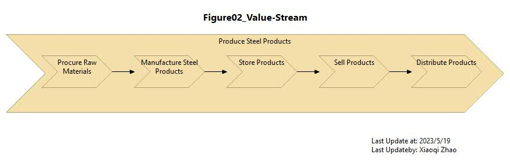

# ArchiMetal Transformation Challenges

## Business Units View

- [Figure 01 Snapshot Model](./ArchiMetal_Transformation_Challenges/ArchiMetal_01-Business-Units.archimate)
- [Figure 01 Modeling Video](https://youtu.be/Uf2GDky0fr8)
- 

---

## Value Stream View

- [Figure 02 Snapshot Model](./ArchiMetal_Transformation_Challenges/ArchiMetal_02-Value-Stream.archimate)
- [Figure 02 Modeling Video](https://youtu.be/gYcE10uV1zU)
- 

---

## Manufacturing Processes - Production and Logistics

- [Figure 03 Snapshot Model](./ArchiMetal_Transformation_Challenges/ArchiMetal_03-Production-and-Logistics-Process.archimate)
- [Figure 03 Modeling Video](https://youtu.be/7dm9UJnn_wk)
- 

---

## Manufacturing Processes - Detail - Steel Production

- [Figure 04 Snapshot Model](./ArchiMetal_Transformation_Challenges/ArchiMetal_04-Steel-Production.archimate)
- [Figure 04 Modeling Video](https://youtu.be/VrG42VLI374)
- 

---

## Manufacturing Processes - Hot Strip Mill in More Detail

- [Figure 05 Snapshot Model](./ArchiMetal_Transformation_Challenges/ArchiMetal_05-Hot-Strip-Mill.archimate)
- [Figure 05 Modeling Video](https://youtu.be/ItmQSrDfCIA)
- -

---