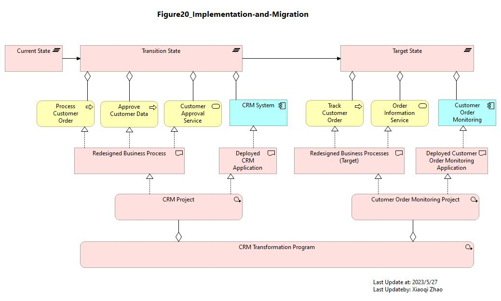

# ArchiMetal Transformation Overview

## Baseline Enterprise Architecture

### Customer Services Provided by DC Benelux

- [Figure 09 Snapshot Model](./ArchiMetal_Transformation_Overview/ArchiMate-09_Customer-Service-DC-Benelux.archimate)
- [Figure 09 Modeling Video](https://youtu.be/cuCTbsOdyHE)
- 

---

### Inter-Dependencies between the Key Sales Processes in DC Benelux, PC, and HQ

- [Figure 10 Snapshot Model](./ArchiMetal_Transformation_Overview/ArchiMate-10_BusinessProcess-BusinessUnits-Mapping.archimate)
- [Figure 10 Modeling Video](https://youtu.be/GBvg8eetFHc)
- 

---

### Information Flows between the Units

- [Figure 11 Snapshot Model](./ArchiMetal_Transformation_Overview/ArchiMate-11_Information-Flows.archimate)
- [Figure 11 Modeling Video](https://youtu.be/amJK4SXH434)
- 

---

### Baseline Application Landscape

- [Figure 12 Snapshot Model](./ArchiMetal_Transformation_Overview/ArchiMate-12_Baseline-Applicaiton-Landscape.archimate)
- [Figure 12 Modeling Video](https://youtu.be/VjufCn9gv3M)
- 

---

### ArchiMetal Corporate Data Center Infrastructure

- [Figure 13 Snapshot Model](./ArchiMetal_Transformation_Overview/ArchiMate-13_Corporate-DC-Infra.archimate)
- [Figure 13 Modeling Video](https://youtu.be/SbWkqM4q7lA)
- 

---

## Target Enterprise Architecture
### Changes on ArchiMetal Organization Structure - Customer Service added

- [Figure 14 Snapshot Model](./ArchiMetal_Transformation_Overview/ArchiMate-14_Changes-to-ArchiMate-Org-Structure.archimate)
- [Figure 14 Modeling Video](https://youtu.be/JDL_zgPNmTk)
- 

---
### Changes on ArchiMetal Organization Structure - Customer Service added

- [Figure 15 Snapshot Model](./ArchiMetal_Transformation_Overview/ArchiMate-15_Relevant-Info-Flows.archimate)
- [Figure 15 Modeling Video](https://youtu.be/ixwLawPIqD0)
- 

---
### Changes on Overall Enterprise Architecture in ArchiMetal

- [Figure 16 Snapshot Model](./ArchiMetal_Transformation_Overview/ArchiMate-16_Changes-in-Overall-EA.archimate)
- [Figure 16 Modeling Video](https://youtu.be/CLOqEUbsqio)
- 

---
### Changes on Overall Enterprise Architecture in ArchiMetal

- [Figure 17 Snapshot Model](./ArchiMetal_Transformation_Overview/ArchiMate-17_New-Customer-Service.archimate)
- [Figure 17 Modeling Video](https://youtu.be/eAYX94QEgXE)
- 

---
### New Processes and their Inter-Dependencies with Existing Processes

- [Figure 18 Snapshot Model](./ArchiMetal_Transformation_Overview/ArchiMate-18_New-and-Existing-Processes.archimate)
- [Figure 18 Modeling Video](https://youtu.be/Uazu6NNXQ70)
- 

---

### New Application Landscape

- [Figure 19 Snapshot Model](./ArchiMetal_Transformation_Overview/ArchiMate-19_New-Application-Landscape.archimate)
- [Figure 19 Modeling Video](https://youtu.be/-_ugYB86kyM)
- 

---

## Implementation and Migration

### Implementation and Migration View for ArchiMetal CRM Transformation Program

- [Figure 20 Snapshot Model](./ArchiMetal_Transformation_Overview/ArchiMate-20_Implementation-and-Migration.archimate)
- [Figure 20 Modeling Video](https://youtu.be/Gp-kTnkAH30)
- 

---

## Modeling Pattern for Transformation Overview

- [Model file for Transformation Overview Modeling Pattern](Model_Files/ArchiMetal-Practice-Patterns.archimate)
- [Modeling Pattern Video for Transformation Overview](https://youtu.be/oCS957tVKHE)
- 

===END of the Chapter===