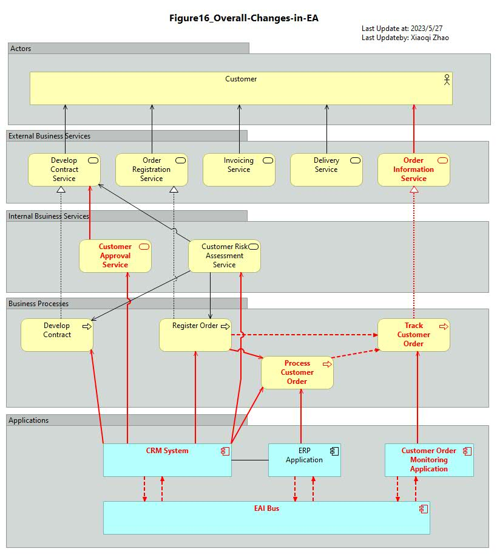

# ArchiMetal Transformation Overview

## Customer Services Provided by DC Benelux

- [Figure 09 Snapshot Model](./ArchiMetal_Transformation_Overview/ArchiMate-09_Customer-Service-DC-Benelux.archimate)
- [Figure 09 Modeling Video](https://youtu.be/cuCTbsOdyHE)
- 

---

## Inter-Dependencies between the Key Sales Processes in DC Benelux, PC, and HQ

- [Figure 10 Snapshot Model](./ArchiMetal_Transformation_Overview/ArchiMate-10_BusinessProcess-BusinessUnits-Mapping.archimate)
- [Figure 10 Modeling Video](https://youtu.be/GBvg8eetFHc)
- 

---

## Information Flows between the Units

- [Figure 11 Snapshot Model](./ArchiMetal_Transformation_Overview/ArchiMate-11_Information-Flows.archimate)
- [Figure 11 Modeling Video](https://youtu.be/amJK4SXH434)
- 

---

## Baseline Application Landscape

- [Figure 12 Snapshot Model](./ArchiMetal_Transformation_Overview/ArchiMate-12_Baseline-Applicaiton-Landscape.archimate)
- [Figure 12 Modeling Video](https://youtu.be/VjufCn9gv3M)
- 

---

## ArchiMetal Corporate Data Center Infrastructure

- [Figure 13 Snapshot Model](./ArchiMetal_Transformation_Overview/ArchiMate-13_Corporate-DC-Infra.archimate)
- [Figure 13 Modeling Video](https://youtu.be/SbWkqM4q7lA)
- 

---
## Changes on ArchiMetal Organization Structure - Customer Service added

- [Figure 14 Snapshot Model](./ArchiMetal_Transformation_Overview/ArchiMate-14_Changes-to-ArchiMate-Org-Structure.archimate)
- [Figure 14 Modeling Video](https://youtu.be/JDL_zgPNmTk)
- 

---
## Changes on ArchiMetal Organization Structure - Customer Service added

- [Figure 15 Snapshot Model](./ArchiMetal_Transformation_Overview/ArchiMate-15_Relevant-Info-Flows.archimate)
- [Figure 15 Modeling Video](https://youtu.be/ixwLawPIqD0)
- 

---
## Changes on Overall Enterprise Architecture in ArchiMetal

- [Figure 16 Snapshot Model](./ArchiMetal_Transformation_Overview/ArchiMate-16_Changes-in-Overall-EA.archimate)
- [Figure 16 Modeling Video](https://youtu.be/CLOqEUbsqio)
- 

---
## Changes on Overall Enterprise Architecture in ArchiMetal

- [Figure 17 Snapshot Model](./ArchiMetal_Transformation_Overview/ArchiMate-17_New-Customer-Service.archimate)
- [Figure 17 Modeling Video](https://youtu.be/eAYX94QEgXE)
- 

---

