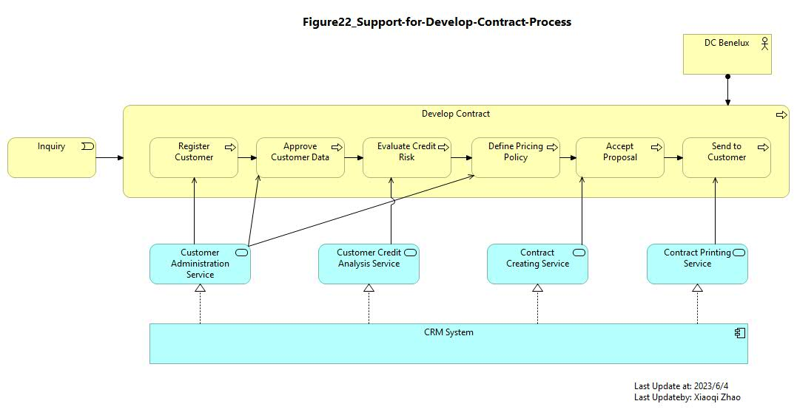

# Detailed Target Enterprise Architecture

## Registration of a New Customer

- [Figure 21 Model File](./Detail_Enterprise_Architecture/ArchiMate-21_Registration-New-Customer.archimate)
- [Figure 21 Modeling Video](https://youtube.com/live/tw3rSWsOvoc)
- 

---

## Support for the Develop Contract Process

- [Figure 22 Model File](./Detail_Enterprise_Architecture/ArchiMate-22_Support-for-Develop-Contract-Process.archimate)
- [Figure 22 Modeling Video](https://youtu.be/GQ_SN2J2I_o)
- 

---

## Registration of Customer Order

- [Figure 23 Model File](Detail_Enterprise_Architecture/ArchiMate-23_Registration-Customer-Order.archimate)
- [Figure 23 Modeling Video](https://youtu.be/Wwc4rC0jBUU)
- 

---

## Application Usage by Register Order Process

- [Figure 24 Model File](./Detail_Enterprise_Architecture/ArchiMate-24_Support-for-Registration-Customer-Order.archimate)
- [Figure 24 Modeling Video](https://youtu.be/lOyZ4CHibos)
- 

---

## Track Customer Order Process

---

## Process Customer Order Process

---

## Applications Usage by the Process Customer Order Process

---
