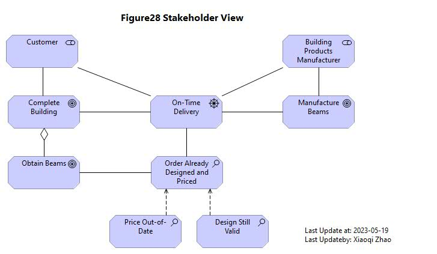
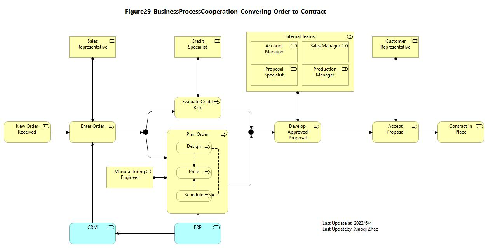
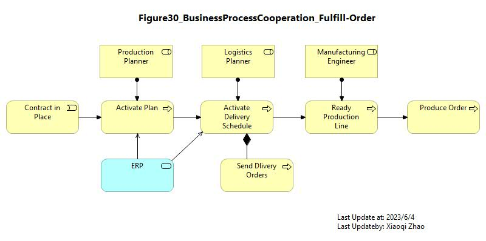
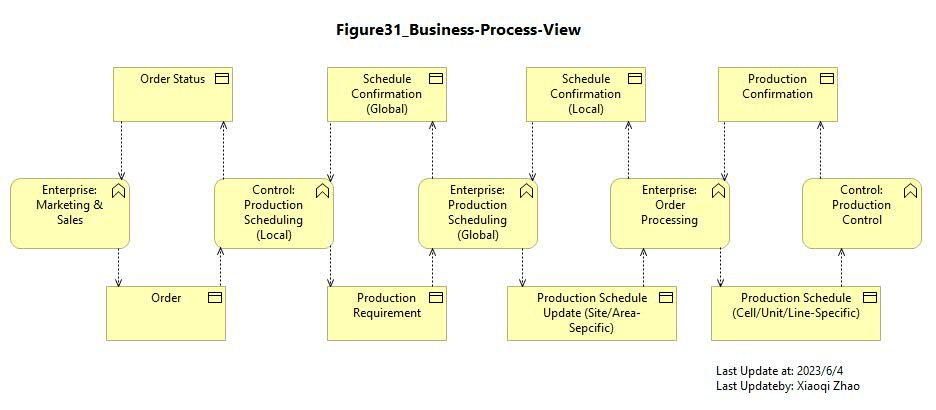

# Target State Scenario: Processing an Urgent Customer Order

## Stakeholder View

- [Figure 28 Model File](./Target_State_Scenario/ArchiMetal_Figure28_Stakeholder-View.archimate)
- [Figure 28 Modeling Video](https://youtu.be/BnwY7qAiSAY)
- 

---

## Business Process Cooperation - Converting an Order to a Contract

- [Figure 29 Model File](./Target_State_Scenario/ArchiMetal_Figure29_BizProcCoop_Convert-Order-to-Contract.archimate)
- [Figure 29 Modeling Video](https://youtu.be/8hk9p7EcEZo)
- 

---

## Business Process Cooperation - Fulfillment of an Order at ArchiMetal

- [Figure 30 Model File](Target_State_Scenario/ArchiMetal_Figure30_BizProcCoop_Fulfill-Order.archimate)
- [Figure 30 Modeling Video](https://youtu.be/Q0ZMMRO6fHU)
- 

---

## Business Process View

- [Figure 31 Model File](Target_State_Scenario/ArchiMetal_Figure31_BizProcView.archimate)
- [Figure 31 Modeling Video](https://youtu.be/q-eTuARGYIM)
- 

---

## Information Structure View

- [Figure 21 Model File](./Detail_Enterprise_Architecture/ArchiMate-21_Registration-New-Customer.archimate)
- [Figure 21 Modeling Video](https://youtube.com/live/tw3rSWsOvoc)
- 

---