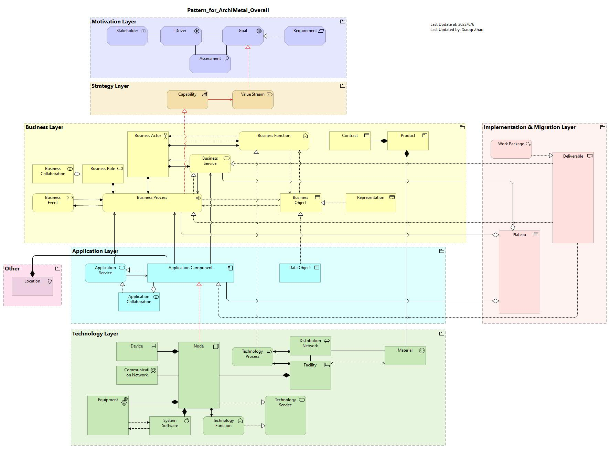

# Modeling Patterns for ArchiMetal Case Study

## Complete Modeling Pattern

## Chapter Pattern - Transformation Challenges

## Chapter Pattern - ArchiMetal Transformation Overview

## Chapter Pattern - Detail Enterprise Architecture

## Chapter Pattern - Target State Scenario

