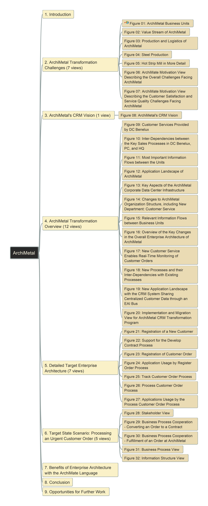

# ArchiMetal_Practice Modeling using Archi
 
 This repository tracks the modeling steps for ArchiMetal case study, using Archi ArchiMate Modeling tool. Click below logo for download the tool and enjoy:

- [Video for Initializing Archi Model](https://youtu.be/8zRQ65DApk8)
- [Initial Archi Model](Model_Files/initial_model.archimate)
 
Here is the structure of the case study (You can explore every view from [GitPage URL](https://yasenstar.github.io/ArchiMetal_Practice/)):

Note: it's using opensource FreePlane to make above mindmap, which can be [downloaded here](https://sourceforge.net/projects/freeplane/).

Go to below chapters for models for every view in detail:

- [ArchiMater Transformation Challenges](2_ArchiMetal_Transformation_Challenges.md)
- [ArchiMetal CRM Vision](./3_ArchiMetal_CRM_Vision.md)
- [ArchiMetal Transformation Overview](./4_ArchiMetal_Transformation_Overview.md)
- [Detailed Target Enterprise Architecture](./5_Detailed_Target_Enterprise_Architecture.md)
- [Target State Scenarios](./6_Target_State_Scenarios.md)

---

## [ArchiSurance Case Study Modeling Patterns](7_ArchiMetal_Modeling_Patterns.md)

---

Any questions, welcome to mail to [Xiaoqi Zhao](mailto:xiaoqizhao@outlook.com)