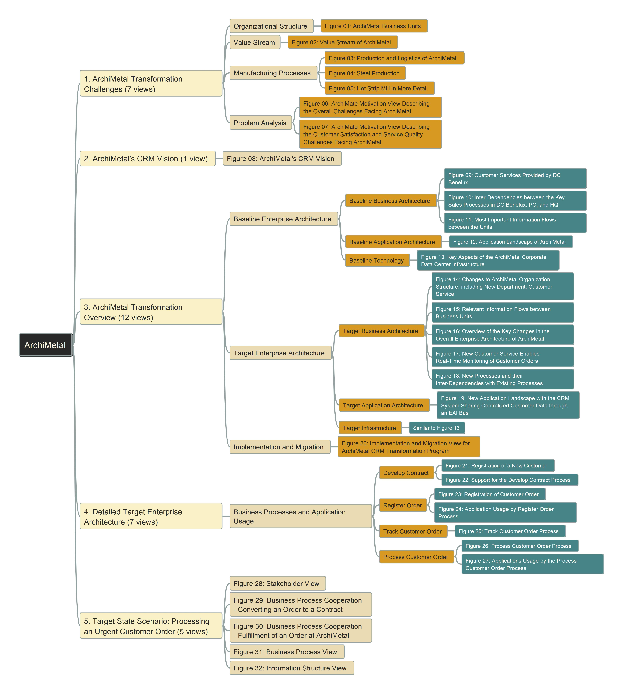

# ArchiMetal_Practice Modeling using Archi
 
 This repository tracks the modeling steps for ArchiMetal case study, using Archi ArchiMate Modeling tool. Click below logo for download the tool and enjoy:

- [Video for Initializing Archi Model](https://youtu.be/8zRQ65DApk8)
- [Initial Archi Model](./initial_model.archimate)

Here is the structure of the case study (You can explore every view from here: [tree](./ArchiMetal-Views-Structure.html), view in [GitPage URL](https://yasenstar.github.io/ArchiMetal_Practice/)):

Note: it's using opensource FreePlane to make above mindmap, which can be [downloaded here](https://sourceforge.net/projects/freeplane/).

---
Any questions, welcome to mail to [Xiaoqi Zhao](mailto:xiaoqizhao@outlook.com)